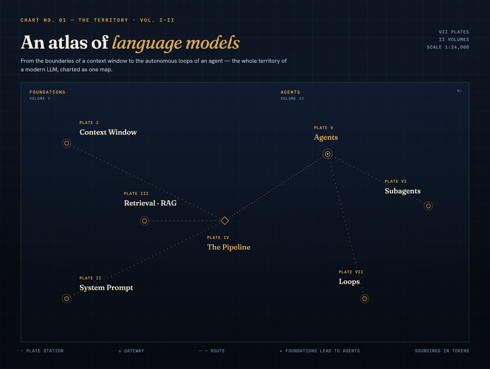
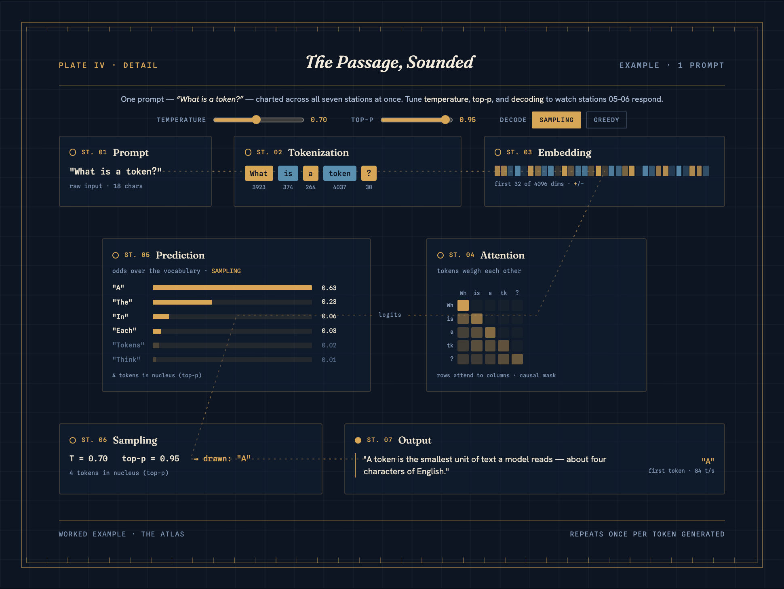
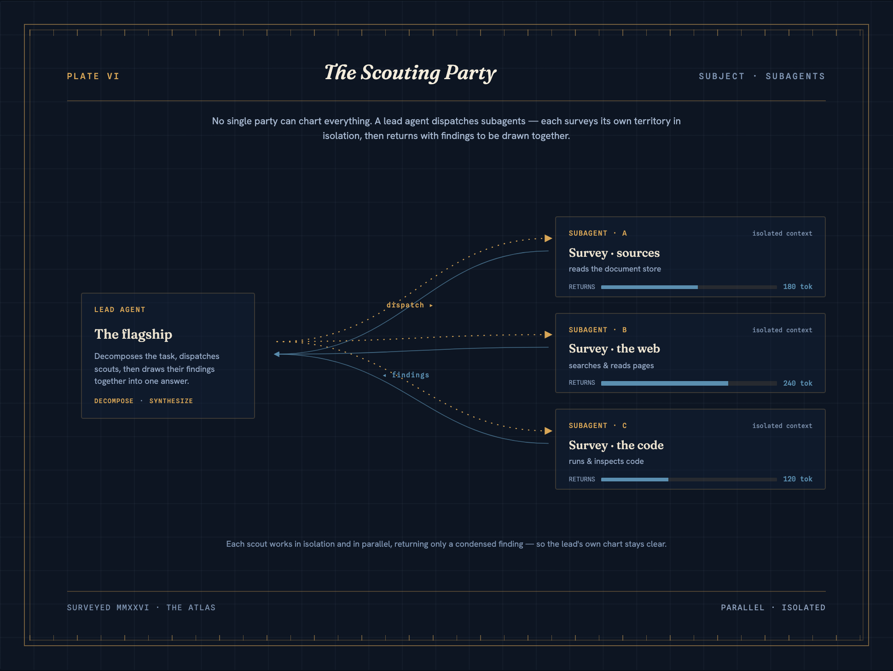

<h1 align="center">The Atlas — an atlas of language models</h1>

<p align="center"><em>From the boundaries of a context window to the autonomous loops of an agent —<br>the whole territory of a modern LLM, charted as one map.</em></p>

<p align="center">
  <a href="https://llm-visualization.pages.dev"><strong>Explore the live site →</strong></a>
</p>

<p align="center">
  
  
  
  
  
</p>

[](https://llm-visualization.pages.dev)

**The Atlas** is a single-page, nautical-chart-themed explainer of LLM internals. It treats a language model as territory to be surveyed: every concept is a numbered chart plate, every process a route, every budget a sounding taken in tokens. One continuously scrolling page with a fixed station rail, hash deep-links (`#/plate-iv`), keyboard paging (`←`/`k`, `→`/`j`), and per-plate entrance animations that fully stand down under `prefers-reduced-motion`. Dark only — dark is the design.

---

## Honesty — read this first

**Every number on this site is illustrative.** Token counts, similarity scores, attention weights, and the candidate logits behind the interactive decode controls are fixed design values, not measurements of any real model. What *is* real is the math: Plate IV·Detail runs an exact softmax with temperature scaling and top-p nucleus truncation over those illustrative logits, live, as you move the sliders. The site never claims to visualize a frontier model's internals — providers do not expose them.

---

## The charts

| Plate | Title | Subject |
|---|---|---|
| — | **Home** | Clickable route map of the whole territory |
| I | *The Boundaries of Memory* | The context window — a 128K-token transect |
| II | *Standing Orders* | The system prompt — read first, every turn |
| III | *Bearings from Afar* | Retrieval/RAG — nearness is similarity |
| IV | *The Inference Passage* | Prompt → tokenize → embed → attend → predict → sample → output |
| IV·D | *The Passage, Sounded* | One prompt through all seven stations, with live temperature / top-p / decode controls |
| V | *The Self-Directed Survey* | Agents — goal, instruments, and the reason–act–observe loop |
| VI | *The Scouting Party* | Subagents — parallel isolated scouts, condensed findings |
| VII | *The Circuit* | Loops — iterations and stop conditions |
| App. | *Gazetteer of Terms* | 17 definitions, each cross-linked to its plate |
| 00 | *About the Atlas* | Colophon and how to read these charts |

### Plate IV·Detail — the interactive sounding

Move the **temperature** and **top-p** sliders or flip **sampling/greedy** and watch the prediction bars and nucleus cutoff recompute instantly — an exact softmax running in the page.



### Plate VI — the scouting party

A lead agent fans dispatch routes out to three isolated subagents; their condensed findings converge back to a single chart.



---

## Under the hood

- **No routing library.** One scrolling document. The active section is the last one whose top passed the viewport midpoint (a rAF-throttled scroll listener), mirrored to `#/{id}` via `replaceState`; deep links land the right plate under the header on a fresh load.
- **A fixed survey sheet.** Every screen is a 1280×960 chart sheet; CSS `zoom` scales the whole stage to the viewport, so plate geometry is authored once in absolute coordinates and never reflows.
- **Real math over illustrative inputs.** [`src/plates/nextToken.ts`](src/plates/nextToken.ts) implements the decode pipeline exactly — softmax with temperature clamped to ≥ 0.05, descending sort, `cum < top-p` nucleus rule, greedy ⇒ rank 1 — with unit tests proving the distribution.
- **A fixed motion grammar.** Each plate enters once — sheet rises, routes dash-draw, stations pop — then gold routes flow and hollow halos pulse quietly. Entrances run on the `motion` library, ambient loops on the Web Animations API, and *all of it* is skipped under `prefers-reduced-motion` with content fully visible.
- **Self-hosted typography.** Fraunces, Hanken Grotesk, and Spline Sans Mono ship as latin variable woff2 from [`public/fonts/`](public/fonts) — no third-party font requests.
- **Accessibility as a release gate.** Every section is a uniquely labelled landmark; keyboard paging ignores form controls so the Plate IV·D sliders stay usable. axe runs twice — per plate in jsdom (`vitest-axe`) and across all 11 live sections in Chromium (`@axe-core/playwright`).
- **Cookieless analytics with a hard ceiling.** Umami, capped at ≤ 15 named events (currently 5); click events are declarative `data-umami-event` attributes, and the site's own `track()` wrapper no-ops when the script hasn't loaded.

## Develop

```bash
nvm use            # Node 20
npm install
npm run dev        # localhost:5173
```

| Command | What it does |
|---|---|
| `npm run build` | Typecheck + production build to `dist/` |
| `npm test` | Vitest unit + a11y-unit suites |
| `npm run e2e` | Playwright E2E (Chromium) |
| `npm run a11y` / `npm run a11y:e2e` | axe scans — per plate (jsdom) and across all 11 live sections |
| `npm run lint` / `npm run format` | ESLint (zero-warning policy) / Prettier |

```
src/
├── app/          # nav context + cross-cutting hooks (scroll-spy, hash sync, keyboard, stage zoom)
├── components/   # chart-sheet frame primitives, header, station rail, section shell
├── plates/       # the eleven screens + plates.config.ts (single source of truth) + decode math
├── motion/       # entrance + ambient animation grammar
└── analytics/    # Umami wrapper, event taxonomy, scene-reach hook
```

Deployed on Cloudflare Pages from `main`; every PR gets a preview URL. Per-release notes live in [CHANGELOG.md](CHANGELOG.md).

## License

MIT — see [LICENSE](LICENSE).
